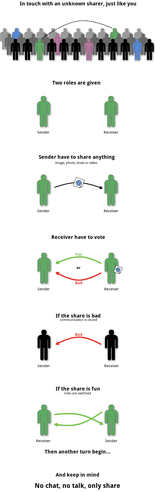

ShareMeAnything
===============

*No chat, no talk, only share*

Based on my [prototype](https://github.com/Cowa/SMA-Prototype).

Concept
-------



Progress
--------

Currently, basic functionalities are implemented (camera, image, draw, YouTube & Vimeo).
The side server is fully functional at this time (it will need improvements later).

The remaining work, before the first release, is the front-end (responsive, cross-devices).

Powered by
----------

Node.js, Express, Socket.IO, AngularJS, AngularUI Router & Material Design.

Run it
------

Obviously, you need **Node.js**.

```npm install && node app.js```

You can enjoy it at your **localhost:8080**
